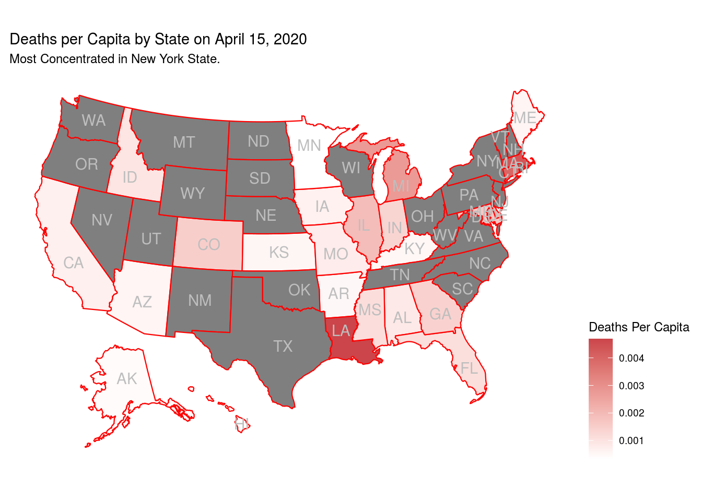
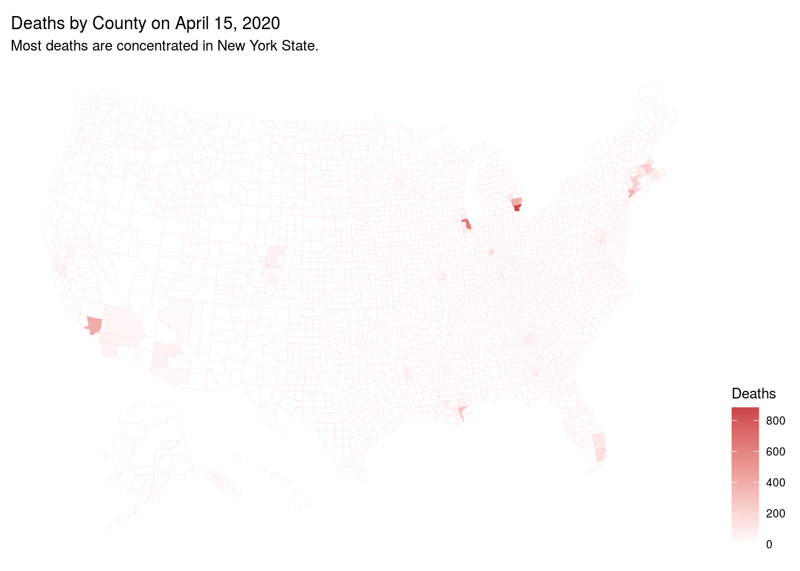
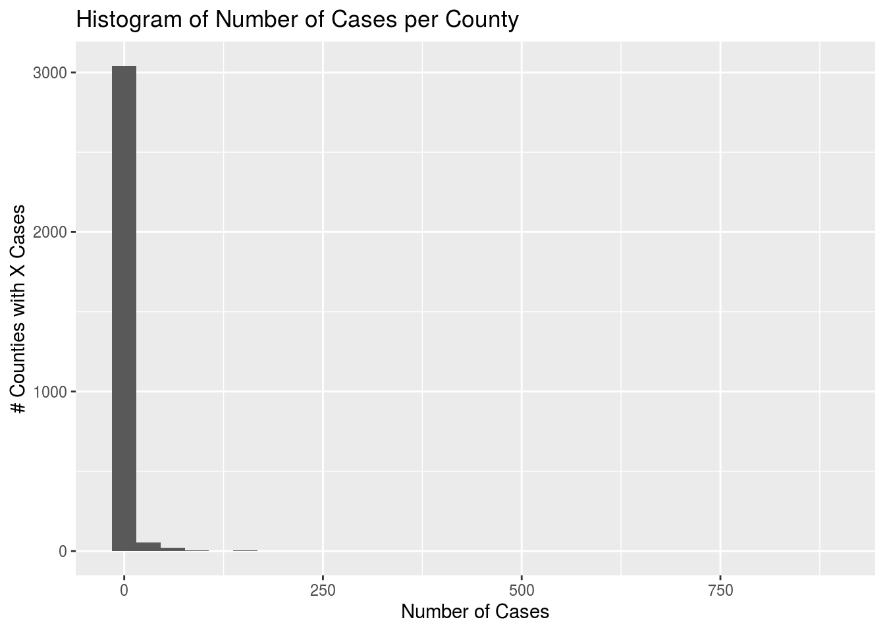
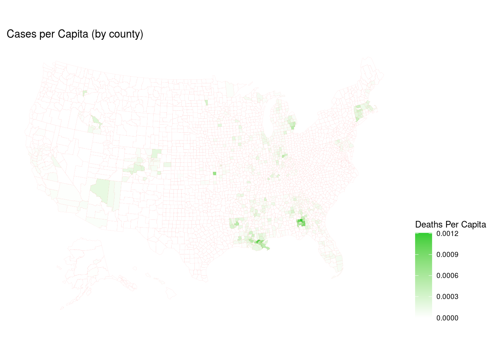
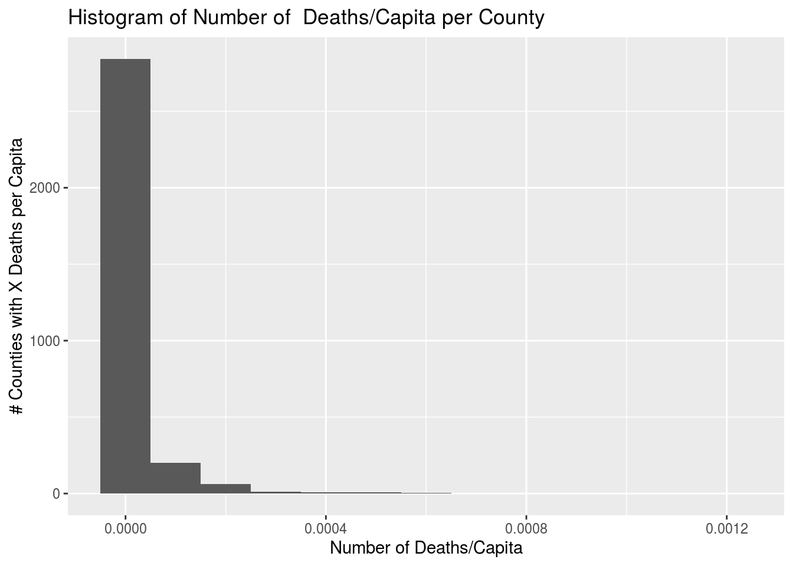
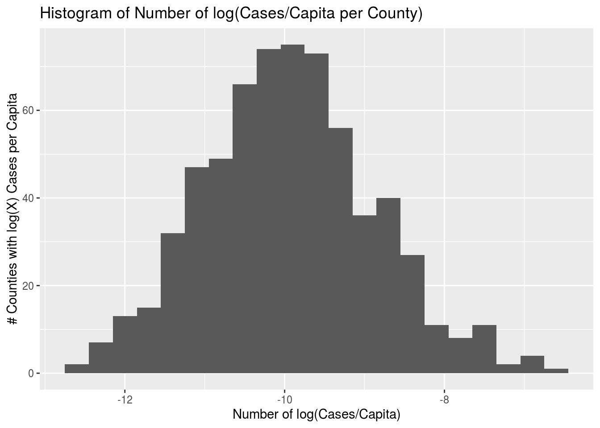

# Load Packages

```r
library(tidyverse)
library(dplyr)
library(ggplot2)
library(usmap)
library(ggthemes)
```


# Datasets and Descriptions
MATT PUT IN DATA INFO HERE (when corona cases stopped tracking, what is pov dataset)

For demographic data, download file called stco-mr2010-1.csv from this url: https://www2.census.gov/programs-surveys/popest/datasets/2010/modified-race-data-2010/.
The data dictionary is located at https://www2.census.gov/programs-surveys/popest/technical-documentation/file-layouts/2000-2010/mr2010.pdf.


```r
covidData <- read.csv("coronacounties.csv")
povertyData <- read.csv("PovertyEstimates.csv")
populationData <- usmap::countypop
populationData$fips <- as.integer(populationData$fips)
demoData <- read.csv("stco-mr2010-1.csv")
```


# Section 1: Introduction

### Exploratory Data Analysis
First, let's start by glimpsing all of our datasets.


```r
glimpse(covidData)
```

```
## Rows: 61,971
## Columns: 6
## $ date   <fct> 2020-01-21, 2020-01-22, 2020-01-23, 2020-01-24, 2020-01-24, 20…
## $ county <fct> Snohomish, Snohomish, Snohomish, Cook, Snohomish, Orange, Cook…
## $ state  <fct> Washington, Washington, Washington, Illinois, Washington, Cali…
## $ fips   <int> 53061, 53061, 53061, 17031, 53061, 6059, 17031, 53061, 4013, 6…
## $ cases  <int> 1, 1, 1, 1, 1, 1, 1, 1, 1, 1, 1, 1, 1, 1, 1, 1, 1, 1, 1, 1, 1,…
## $ deaths <int> 0, 0, 0, 0, 0, 0, 0, 0, 0, 0, 0, 0, 0, 0, 0, 0, 0, 0, 0, 0, 0,…
```

```r
covidData %>%
  group_by(fips) %>%
  count()
```

```
## # A tibble: 2,709 x 2
## # Groups:   fips [2,709]
##     fips     n
##    <int> <int>
##  1  1001    23
##  2  1003    33
##  3  1005    13
##  4  1007    17
##  5  1009    22
##  6  1011    21
##  7  1013    22
##  8  1015    29
##  9  1017    28
## 10  1019    22
## # … with 2,699 more rows
```

At first glimpse, the COVID-19 dataset has 61,971 observations and 6 variables. However, after grouping by FIPS code, we see that the dataset contains data on 2,709 counties, with repeated observations representing cases on different dates.


```r
glimpse(povertyData)
```

```
## Rows: 3,193
## Columns: 34
## $ FIPStxt                         <int> 0, 1000, 1001, 1003, 1005, 1007, 1009…
## $ Stabr                           <fct> US, AL, AL, AL, AL, AL, AL, AL, AL, A…
## $ Area_name                       <fct> United States, Alabama, Autauga Count…
## $ Rural.urban_Continuum_Code_2003 <int> NA, NA, 2, 4, 6, 1, 1, 6, 6, 3, 6, 8,…
## $ Urban_Influence_Code_2003       <int> NA, NA, 2, 5, 6, 1, 1, 6, 6, 2, 5, 6,…
## $ Rural.urban_Continuum_Code_2013 <int> NA, NA, 2, 3, 6, 1, 1, 6, 6, 3, 6, 6,…
## $ Urban_Influence_Code_2013       <int> NA, NA, 2, 2, 6, 1, 1, 6, 6, 2, 5, 6,…
## $ POVALL_2018                     <fct> "41,852,315", "801,758", "7,587", "21…
## $ CI90LBAll_2018                  <fct> "41,619,366", "785,668", "6,334", "17…
## $ CI90UBALL_2018                  <fct> "42,085,264", "817,848", "8,840", "24…
## $ PCTPOVALL_2018                  <dbl> 13.1, 16.8, 13.8, 9.8, 30.9, 21.8, 13…
## $ CI90LBALLP_2018                 <dbl> 13.0, 16.5, 11.5, 8.1, 25.8, 17.1, 10…
## $ CI90UBALLP_2018                 <dbl> 13.2, 17.1, 16.1, 11.5, 36.0, 26.5, 1…
## $ POV017_2018                     <fct> "12,997,532", "255,613", "2,509", "6,…
## $ CI90LB017_2018                  <fct> "12,873,127", "247,744", "1,965", "4,…
## $ CI90UB017_2018                  <fct> "13,121,937", "263,482", "3,053", "8,…
## $ PCTPOV017_2018                  <dbl> 18.0, 23.9, 19.3, 13.9, 43.9, 27.8, 1…
## $ CI90LB017P_2018                 <dbl> 17.8, 23.2, 15.1, 10.2, 35.0, 20.7, 1…
## $ CI90UB017P_2018                 <dbl> 18.2, 24.6, 23.5, 17.6, 52.8, 34.9, 2…
## $ POV517_2018                     <fct> "8,930,152", "178,175", "1,891", "4,5…
## $ CI90LB517_2018                  <fct> "8,834,521", "171,349", "1,469", "3,2…
## $ CI90UB517_2018                  <fct> "9,025,783", "185,001", "2,313", "5,8…
## $ PCTPOV517_2018                  <dbl> 17.0, 22.8, 19.5, 13.1, 36.7, 26.3, 1…
## $ CI90LB517P_2018                 <dbl> 16.8, 21.9, 15.1, 9.3, 27.5, 19.0, 10…
## $ CI90UB517P_2018                 <dbl> 17.2, 23.7, 23.9, 16.9, 45.9, 33.6, 2…
## $ MEDHHINC_2018                   <fct> "61,937", "49,881", "59,338", "57,588…
## $ CI90LBINC_2018                  <fct> "61,843", "49,123", "53,628", "54,437…
## $ CI90UBINC_2018                  <fct> "62,031", "50,639", "65,048", "60,739…
## $ POV04_2018                      <fct> "3,758,704", "73,915", "", "", "", ""…
## $ CI90LB04_2018                   <fct> "3,714,862", "69,990", "", "", "", ""…
## $ CI90UB04_2018                   <fct> "3,802,546", "77,840", "", "", "", ""…
## $ PCTPOV04_2018                   <dbl> 19.5, 26.0, NA, NA, NA, NA, NA, NA, N…
## $ CI90LB04P_2018                  <dbl> 19.3, 24.6, NA, NA, NA, NA, NA, NA, N…
## $ CI90UB04P_2018                  <dbl> 19.7, 27.4, NA, NA, NA, NA, NA, NA, N…
```

The Poverty dataset has 3,193 observations (counties, states, and the US) and 34 variables.


```r
glimpse(demoData)
```

```
## Rows: 640,585
## Columns: 10
## $ SUMLEV  <int> 50, 50, 50, 50, 50, 50, 50, 50, 50, 50, 50, 50, 50, 50, 50, 5…
## $ STATE   <int> 1, 1, 1, 1, 1, 1, 1, 1, 1, 1, 1, 1, 1, 1, 1, 1, 1, 1, 1, 1, 1…
## $ COUNTY  <int> 1, 1, 1, 1, 1, 1, 1, 1, 1, 1, 1, 1, 1, 1, 1, 1, 1, 1, 1, 1, 1…
## $ STNAME  <fct> Alabama, Alabama, Alabama, Alabama, Alabama, Alabama, Alabama…
## $ CTYNAME <fct> Autauga County, Autauga County, Autauga County, Autauga Count…
## $ SEX     <int> 1, 1, 1, 1, 1, 1, 1, 1, 1, 1, 1, 1, 1, 1, 1, 1, 1, 1, 1, 1, 1…
## $ ORIGIN  <int> 1, 1, 1, 1, 1, 1, 1, 1, 1, 1, 1, 1, 1, 1, 1, 1, 1, 1, 1, 1, 1…
## $ AGEGRP  <int> 1, 1, 1, 1, 1, 1, 1, 1, 1, 1, 1, 1, 1, 2, 2, 2, 2, 2, 2, 2, 2…
## $ IMPRACE <int> 1, 2, 3, 4, 6, 7, 8, 10, 11, 16, 17, 19, 21, 1, 2, 3, 4, 6, 7…
## $ RESPOP  <int> 1337, 356, 2, 13, 33, 11, 17, 4, 1, 1, 1, 1, 1, 1460, 398, 12…
```

```r
white_people_by_county <- demoData %>% 
        filter(IMPRACE == 1, ORIGIN == 1) %>% 
        group_by(STATE, COUNTY) %>% 
        summarise(num_white = sum(RESPOP))
  
black_people_by_county <- demoData %>% 
        filter(IMPRACE == 2, ORIGIN == 1) %>% 
        group_by(STATE, COUNTY) %>% 
        summarise(num_black = sum(RESPOP))

asian_people_by_county <- demoData %>% 
        filter(IMPRACE == 4, ORIGIN == 1) %>% 
        group_by(STATE, COUNTY) %>% 
        summarise(num_asian = sum(RESPOP))
  
hispanic_people_by_county <- demoData %>% 
        filter(ORIGIN == 2) %>% 
        group_by(STATE, COUNTY) %>% 
        summarise(num_hispanic = sum(RESPOP))

other_by_county <- demoData %>% 
        filter(ORIGIN == 1, !(IMPRACE %in% c(1,2,4))) %>% 
        group_by(STATE, COUNTY) %>% 
        summarise(num_other = sum(RESPOP))

non_white_people_by_county <- demoData %>% 
        filter(IMPRACE !=1 | ORIGIN != 1) %>% 
        group_by(STATE, COUNTY) %>% 
        summarise(num_nonwhite = sum(RESPOP))

demographicsData <- full_join(full_join( full_join(white_people_by_county,
                                black_people_by_county),
                                full_join(hispanic_people_by_county,
                                asian_people_by_county)),
                                full_join(other_by_county,
                                non_white_people_by_county))
```

```
## Joining, by = c("STATE", "COUNTY")
## Joining, by = c("STATE", "COUNTY")
## Joining, by = c("STATE", "COUNTY")
## Joining, by = c("STATE", "COUNTY")
## Joining, by = c("STATE", "COUNTY")
```

```r
create_fips <- function(ste, cnty){
  if (cnty < 10){
    c <- paste("00",as.character(cnty),sep="")
  }
  else if (cnty<100){
    c <- paste("0",as.character(cnty),sep="")
  }
  else{
    c <- as.character(cnty)
  }
  
  if (ste<10){
    s <- paste("0",as.character(ste),sep="")
  }
  else{
    s <- as.character(ste)
  }
  return(as.integer(paste(s,c,sep="")[1]))
}

demographicsData['fips'] <- mapply(create_fips, demographicsData$STATE, 
                                    demographicsData$COUNTY)

demoDfPopulation <- demographicsData['num_white'] + demographicsData['num_nonwhite'] 

demographicsData['perc_white'] <- demographicsData$num_white/demoDfPopulation
demographicsData['perc_black'] <- demographicsData$num_black/demoDfPopulation
demographicsData['perc_hispanic'] <- demographicsData$num_hispanic/demoDfPopulation
demographicsData['perc_nonwhite'] <- demographicsData$num_nonwhite/demoDfPopulation

glimpse(demographicsData)
```

```
## Rows: 1,598
## Columns: 13
## Groups: STATE [26]
## $ STATE         <int> 1, 1, 1, 1, 1, 1, 1, 1, 1, 1, 1, 1, 1, 1, 1, 1, 1, 1, 1…
## $ COUNTY        <int> 1, 3, 5, 7, 9, 11, 13, 15, 17, 19, 21, 23, 25, 27, 29, …
## $ num_white     <int> 42194, 152474, 12849, 17208, 50991, 2393, 11329, 87381,…
## $ num_black     <int> 9603, 17022, 12830, 5032, 731, 7644, 9052, 24232, 13222…
## $ num_hispanic  <int> 1310, 7992, 1387, 406, 4626, 777, 191, 3893, 536, 320, …
## $ num_asian     <int> 474, 1349, 112, 22, 120, 20, 174, 839, 167, 50, 125, 12…
## $ num_other     <int> 990, 3428, 279, 247, 854, 80, 201, 2227, 377, 464, 496,…
## $ num_nonwhite  <int> 12377, 29791, 14608, 5707, 6331, 8521, 9618, 31191, 143…
## $ fips          <int> 1001, 1003, 1005, 1007, 1009, 1011, 1013, 1015, 1017, 1…
## $ perc_white    <dbl> 0.7731946, 0.8365512, 0.4679681, 0.7509492, 0.8895537, …
## $ perc_black    <dbl> 0.17597259, 0.09339149, 0.46727610, 0.21959415, 0.01275…
## $ perc_hispanic <dbl> 0.024005424, 0.043848243, 0.050515351, 0.017717652, 0.0…
## $ perc_nonwhite <dbl> 0.22680545, 0.16344882, 0.53203190, 0.24905084, 0.11044…
```


Both the COVID-19 dataset and the Poverty dataset have a variation of the variable `fips`, which is the Federal Information Processing Standard [https://en.wikipedia.org/wiki/FIPS_county_code] that allows counties to be uniquely identified. 

Thus, the FIPS variable is a good variable by which to join these 2 datasets:


```r
data <- merge(covidData, povertyData, by.x = 'fips', by.y = 'FIPStxt')
data <- merge(data, populationData, by.x = 'fips', by.y = 'fips')
data <- merge(data, demographicsData, by.x = 'fips', by.y = 'fips')
glimpse(data)
```

```
## Rows: 32,587
## Columns: 54
## $ fips                            <int> 1001, 1001, 1001, 1001, 1001, 1001, 1…
## $ date                            <fct> 2020-04-12, 2020-04-13, 2020-04-04, 2…
## $ county.x                        <fct> Autauga, Autauga, Autauga, Autauga, A…
## $ state                           <fct> Alabama, Alabama, Alabama, Alabama, A…
## $ cases                           <int> 19, 19, 12, 17, 10, 6, 6, 12, 17, 12,…
## $ deaths                          <int> 1, 1, 0, 1, 0, 0, 0, 1, 1, 0, 0, 0, 0…
## $ Stabr                           <fct> AL, AL, AL, AL, AL, AL, AL, AL, AL, A…
## $ Area_name                       <fct> Autauga County, Autauga County, Autau…
## $ Rural.urban_Continuum_Code_2003 <int> 2, 2, 2, 2, 2, 2, 2, 2, 2, 2, 2, 2, 2…
## $ Urban_Influence_Code_2003       <int> 2, 2, 2, 2, 2, 2, 2, 2, 2, 2, 2, 2, 2…
## $ Rural.urban_Continuum_Code_2013 <int> 2, 2, 2, 2, 2, 2, 2, 2, 2, 2, 2, 2, 2…
## $ Urban_Influence_Code_2013       <int> 2, 2, 2, 2, 2, 2, 2, 2, 2, 2, 2, 2, 2…
## $ POVALL_2018                     <fct> "7,587", "7,587", "7,587", "7,587", "…
## $ CI90LBAll_2018                  <fct> "6,334", "6,334", "6,334", "6,334", "…
## $ CI90UBALL_2018                  <fct> "8,840", "8,840", "8,840", "8,840", "…
## $ PCTPOVALL_2018                  <dbl> 13.8, 13.8, 13.8, 13.8, 13.8, 13.8, 1…
## $ CI90LBALLP_2018                 <dbl> 11.5, 11.5, 11.5, 11.5, 11.5, 11.5, 1…
## $ CI90UBALLP_2018                 <dbl> 16.1, 16.1, 16.1, 16.1, 16.1, 16.1, 1…
## $ POV017_2018                     <fct> "2,509", "2,509", "2,509", "2,509", "…
## $ CI90LB017_2018                  <fct> "1,965", "1,965", "1,965", "1,965", "…
## $ CI90UB017_2018                  <fct> "3,053", "3,053", "3,053", "3,053", "…
## $ PCTPOV017_2018                  <dbl> 19.3, 19.3, 19.3, 19.3, 19.3, 19.3, 1…
## $ CI90LB017P_2018                 <dbl> 15.1, 15.1, 15.1, 15.1, 15.1, 15.1, 1…
## $ CI90UB017P_2018                 <dbl> 23.5, 23.5, 23.5, 23.5, 23.5, 23.5, 2…
## $ POV517_2018                     <fct> "1,891", "1,891", "1,891", "1,891", "…
## $ CI90LB517_2018                  <fct> "1,469", "1,469", "1,469", "1,469", "…
## $ CI90UB517_2018                  <fct> "2,313", "2,313", "2,313", "2,313", "…
## $ PCTPOV517_2018                  <dbl> 19.5, 19.5, 19.5, 19.5, 19.5, 19.5, 1…
## $ CI90LB517P_2018                 <dbl> 15.1, 15.1, 15.1, 15.1, 15.1, 15.1, 1…
## $ CI90UB517P_2018                 <dbl> 23.9, 23.9, 23.9, 23.9, 23.9, 23.9, 2…
## $ MEDHHINC_2018                   <fct> "59,338", "59,338", "59,338", "59,338…
## $ CI90LBINC_2018                  <fct> "53,628", "53,628", "53,628", "53,628…
## $ CI90UBINC_2018                  <fct> "65,048", "65,048", "65,048", "65,048…
## $ POV04_2018                      <fct> , , , , , , , , , , , , , , , , , , ,…
## $ CI90LB04_2018                   <fct> , , , , , , , , , , , , , , , , , , ,…
## $ CI90UB04_2018                   <fct> , , , , , , , , , , , , , , , , , , ,…
## $ PCTPOV04_2018                   <dbl> NA, NA, NA, NA, NA, NA, NA, NA, NA, N…
## $ CI90LB04P_2018                  <dbl> NA, NA, NA, NA, NA, NA, NA, NA, NA, N…
## $ CI90UB04P_2018                  <dbl> NA, NA, NA, NA, NA, NA, NA, NA, NA, N…
## $ abbr                            <chr> "AL", "AL", "AL", "AL", "AL", "AL", "…
## $ county.y                        <chr> "Autauga County", "Autauga County", "…
## $ pop_2015                        <dbl> 55347, 55347, 55347, 55347, 55347, 55…
## $ STATE                           <int> 1, 1, 1, 1, 1, 1, 1, 1, 1, 1, 1, 1, 1…
## $ COUNTY                          <int> 1, 1, 1, 1, 1, 1, 1, 1, 1, 1, 1, 1, 1…
## $ num_white                       <int> 42194, 42194, 42194, 42194, 42194, 42…
## $ num_black                       <int> 9603, 9603, 9603, 9603, 9603, 9603, 9…
## $ num_hispanic                    <int> 1310, 1310, 1310, 1310, 1310, 1310, 1…
## $ num_asian                       <int> 474, 474, 474, 474, 474, 474, 474, 47…
## $ num_other                       <int> 990, 990, 990, 990, 990, 990, 990, 99…
## $ num_nonwhite                    <int> 12377, 12377, 12377, 12377, 12377, 12…
## $ perc_white                      <dbl> 0.7731946, 0.7731946, 0.7731946, 0.77…
## $ perc_black                      <dbl> 0.17597259, 0.17597259, 0.17597259, 0…
## $ perc_hispanic                   <dbl> 0.02400542, 0.02400542, 0.02400542, 0…
## $ perc_nonwhite                   <dbl> 0.2268054, 0.2268054, 0.2268054, 0.22…
```


```r
state_cases <- data %>%
  filter(date == "2020-04-15") %>%
  group_by(state) %>%
  summarise(total_deaths = sum(deaths))

cases_map <- plot_usmap(data = state_cases, values = "total_deaths", labels = TRUE, label_color = "gray", color = "red")

cases_map <- cases_map + 
              scale_fill_gradient(low = "white", high = "#CB454A", name = "Cases") +
              labs(title = "Deaths by State on April 15, 2020") + 
              labs(subtitle = "Most deaths are concentrated in New York State.") + 
              theme(legend.position = "right")

cases_map
```


Need to add histograms for the response variable we choose, the predictors we choose, and plots for the response v. predictors relationships
(We can do this in the section following - response variable description and predictor descriptions)


```r
state_capita_deaths <- data %>%
  filter(date == "2020-04-15") %>%
  group_by(state) %>%
  summarise(deaths_per_capita = sum(cases)/sum(pop_2015))

capita_deaths_map <- plot_usmap(data = state_capita_deaths, values = "deaths_per_capita", labels = TRUE, label_color = "gray", color = "red")

capita_deaths_map <- capita_deaths_map + 
              scale_fill_gradient(low = "white", high = "#CB454A", name = "Deaths Per Capita") +
              labs(title = "Deaths per Capita by State on April 15, 2020") + 
              labs(subtitle = "Most Concentrated in New York State.") + 
              theme(legend.position = "right")

capita_deaths_map
```




```r
county_deaths <- data %>%
  filter(date == "2020-04-15")

county_deaths <- merge(x = populationData, y = county_deaths, by = "fips", all = TRUE)

county_deaths$pop_2015 <- county_deaths$pop_2015.x

county_deaths$log_deaths <- log(county_deaths$deaths)
county_deaths$deaths[is.na(county_deaths$deaths)] <- 0
county_deaths$log_deaths[is.na(county_deaths$log_deaths) | is.infinite(county_deaths$log_deaths)] <- 0


county_deaths_map <- plot_usmap("counties", data = county_deaths, values = "deaths", color = "red", size=0.01)

county_deaths_map <- county_deaths_map + 
              scale_fill_gradient(low = "white", high = "#CB454A", name = "Deaths") +
              labs(title = "Deaths by County on April 15, 2020") + 
              labs(subtitle = "Most deaths are concentrated in New York State.") + 
              theme(legend.position = "right")

county_deaths_map
```



```r
county_deaths_map <- plot_usmap("counties", data = county_deaths, values = "log_deaths", color = "red", size=0.01)

county_deaths_map <- county_deaths_map + 
              scale_fill_gradient(low = "white", high = "#CB454A", name = "Log Deaths") +
              labs(title = "Log Deaths by County on April 15, 2020") + 
              labs(subtitle = "Most deaths are concentrated in New York State.") + 
              theme(legend.position = "right")

county_deaths_map
```


```r
plot_poverty_data <- merge(populationData, povertyData, by.x = 'fips', by.y = 'FIPStxt')

county_cases_map <- plot_usmap("counties", data = plot_poverty_data, values = "PCTPOVALL_2018", color = "red", size=0.01)

county_cases_map <- county_cases_map + 
              scale_fill_gradient(low = "white", high = "#CB454A", name = "PCTPOVALL_2018") +
              labs(title = "Poverty Level by County (2018 values)") + 
              theme(legend.position = "right")

county_cases_map
```


We should look at histograms of both cases and log(cases) to see if the apparent more even spread of log(cases) is normal compared to regular cases


```r
county_deaths %>%
  ggplot(mapping = aes(x = deaths)) +
  geom_histogram() + 
  labs(title = "Histogram of Number of Cases per County", x = "Number of Cases",
       y = "# Counties with X Cases")
```

```
## `stat_bin()` using `bins = 30`. Pick better value with `binwidth`.
```



As we predicted, we see an incredible amount of right skewness in the distribution of cases per county.


```r
county_deaths %>%
  ggplot(mapping = aes(x = log(deaths))) +
  geom_histogram() + 
  labs(title = "Histogram of Number of log of # Cases per County", x = "Number of Cases",
       y = "# Counties with log(X) Cases")
```

```
## `stat_bin()` using `bins = 30`. Pick better value with `binwidth`.
```

```
## Warning: Removed 2493 rows containing non-finite values (stat_bin).
```


This historam of the log(cases) per county shows much more evidence of normailty than the graph of just cases. It would be a much better response variable, however we should analyze some other options as well.

Another possible option to analyze as a response would be the number of cases per capita of a county. This may work better as it would correlate significantly less with population as we have "accounted" for this already in the response.


```r
county_deaths <- county_deaths %>%
  mutate(casesPC = deaths/pop_2015)

casesPC_map <- plot_usmap("counties", data = county_deaths, values = "casesPC", color = "red", size=0.01)

casesPC_map <- casesPC_map + 
              scale_fill_gradient(low = "white", high = "limegreen", name = "Deaths Per Capita") +
              labs(title = "Cases per Capita (by county)") + 
              theme(legend.position = "right")

casesPC_map
```

```
## Warning: Use of `map_df$x` is discouraged. Use `x` instead.
```

```
## Warning: Use of `map_df$y` is discouraged. Use `y` instead.
```

```
## Warning: Use of `map_df$group` is discouraged. Use `group` instead.
```



```r
county_deaths %>%
  ggplot(mapping = aes(x = casesPC)) +
  geom_histogram(binwidth = 0.0001) + 
  labs(title = "Histogram of Number of  Deaths/Capita per County", x = "Number of Deaths/Capita",
       y = "# Counties with X Deaths per Capita")
```



Similarly to the map of cases per county, we see a large discrepancy between counties and may benefit from mapping the log of the cases per capita in order to better normalize the distribution. The histogram confirms this theory as it is majorly right skewed.


```r
county_deaths$log_casesPC <- log(county_deaths$casesPC)
county_deaths$casesPC[is.na(county_deaths$casesPC)] <- 0
county_deaths$log_casesPC[is.na(county_deaths$log_casesPC)] <- 0

logcasesPC_map <- plot_usmap("counties", data = county_deaths, values = "log_casesPC", color = "red", size=0.01)

logcasesPC_map <- logcasesPC_map + 
              scale_fill_gradient(low = "white", high = "limegreen", name = "Log of Cases per Capita") +
              labs(title = "Log of Cases per Capita (by county)") + 
              theme(legend.position = "right")

logcasesPC_map
```

```
## Warning: Use of `map_df$x` is discouraged. Use `x` instead.
```

```
## Warning: Use of `map_df$y` is discouraged. Use `y` instead.
```

```
## Warning: Use of `map_df$group` is discouraged. Use `group` instead.
```


```r
county_deaths %>%
  ggplot(mapping = aes(x = log_casesPC)) +
  geom_histogram(binwidth = 0.3) + 
  labs(title = "Histogram of Number of log(Cases/Capita per County)", x = "Number of log(Cases/Capita)",
       y = "# Counties with log(X) Cases per Capita")
```

```
## Warning: Removed 2493 rows containing non-finite values (stat_bin).
```



We see a much more even distribution using the log of cases per capita. It is important to note that many counties appear as grey in this map; these counties have zero cases and thus the log of them returns the value of negative infinity causing this. We can remove or standardize them in our later analysis. The histogram of the log of cases per capita is very normal which would be perfect for analysis.

### Description of the Response Variable

The response variable for use in the model will be log of cases per capita. As shown above, this version of the response variable deals with some of the skewness in cases per capita. 

### Descriptions of the Regressors

THe full model will start with all of the variables included in the `data` dataset, as this is the dataset in which information about COVID-19, demographics, poverty-levels, and population statistics has been combined. Once this full model has been created, backwards selection will be used to select the variables that are most significant in predicting log cases per capita.

# Section 2: Regression Analysis 
### Generating Our Model

### Testing Our Assumptions

### Multicollinearity

### Interaction Effects

### Influential Points

### Interpreting The Coefficients


# Section 3: Conclusion

### General Commentary

### Discussion of Results

### Limitations and Ideas for Further Research 
